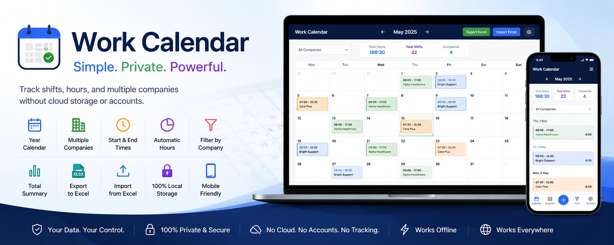

# 📅 Work Calendar

A simple, fast, and privacy-focused work calendar for tracking shifts, hours, and multiple companies — without cloud storage or accounts.

All data is stored locally in your browser, giving you full control and privacy.

---

## ✨ Features

- 📅 Year-based calendar view  
- 🏢 Track work across multiple companies  
- ⏰ Start and end time logging  
- 📊 Automatic total hours calculation  
- 🎨 Colour-coded companies  
- 🔍 Filter shifts by company  
- 📈 Total hours summary  
- 📤 Export data to Excel (backup & sharing)  
- 📥 Import data from Excel (restore & transfer)  
- 💾 Local browser storage (no cloud, no login)  
- 📱 Mobile-friendly design (PWA-ready)  

---

## 🎯 Purpose

This app is designed for people who need a simple way to track work across different employers without complex systems.

It is ideal for:

- Agency workers  
- Casual employees  
- Contractors  
- Freelancers  
- Healthcare staff  
- Support workers  
- Cleaners  
- Drivers  
- Hospitality workers  

---

## 👨‍💼 Staff Shift Planning Mode

The calendar can also be used as a lightweight shift planner for teams.

Managers can:

- Assign employee shifts  
- Organize work schedules  
- View shifts by company  
- Track total working hours  
- Export schedules to Excel  
- Import schedules when needed  

---

## 📤 Export & 📥 Import (Data Safety)

### 📤 Export (Backup Data)

Export allows you to download all calendar data as an Excel file.

**Why it matters:**

- 🔒 Prevents data loss if browser storage is cleared  
- 💻 Transfers data between devices  
- 📊 Creates backups and reports  
- 📤 Enables sharing schedules  

> Export = your backup safety file  

---

### 📥 Import (Restore Data)

Import allows you to load previously exported Excel files back into the app.

**Why it matters:**

- 🔄 Restores data after reinstalling or resetting  
- 📱 Moves data between devices  
- 🧾 Recovers old schedules  
- 🛠 Fixes accidental data loss  

> Import = your restore & recovery tool  

---

### ⚠️ Important Note

Because all data is stored locally in your browser:

- Clearing browser data will remove your shifts  
- Switching devices will not sync data automatically  
- Device failure may result in data loss  

👉 **Always export backups regularly**

---

## 💾 Data Storage

This app does not use any backend or cloud service.

- ❌ No accounts required  
- ❌ No tracking  
- ❌ No internet needed after loading  
- ❌ No subscriptions  

All data is saved using **browser Local Storage**.

---

## 📱 Install as a Mobile App (PWA)

You can install Work Calendar on your phone like a native app.

### Android (Chrome)

1. Open the app in Google Chrome  
2. Tap the **⋮** menu  
3. Select **Add to Home screen** or **Install app**  
4. Confirm installation  

### iPhone & iPad (Safari)

1. Open the app in Safari  
2. Tap the **Share** button  
3. Select **Add to Home Screen**  
4. Confirm  

---

## 🧰 Technologies Used

- HTML5  
- CSS3  
- JavaScript (Vanilla)   

---

## 🚀 Getting Started

1. Download or clone this repository  
2. Open `index.html` in any modern browser  
3. Start adding shifts immediately  

No installation or server required.

---

## 💡 Future Improvements

- Multiple employee profiles  
- Monthly / yearly reports  
- Overtime tracking  
- Shift notes  
- Pay calculation system  
- Leave management  
- Public holiday integration  
- Dark / light mode  
- Cloud backup option (optional)  

---

## 📄 License

This project is open source and free to use.

You are free to modify and adapt it for personal or commercial use.
